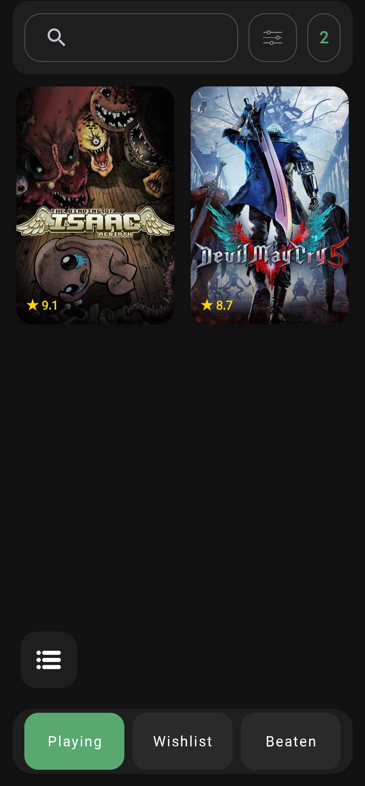
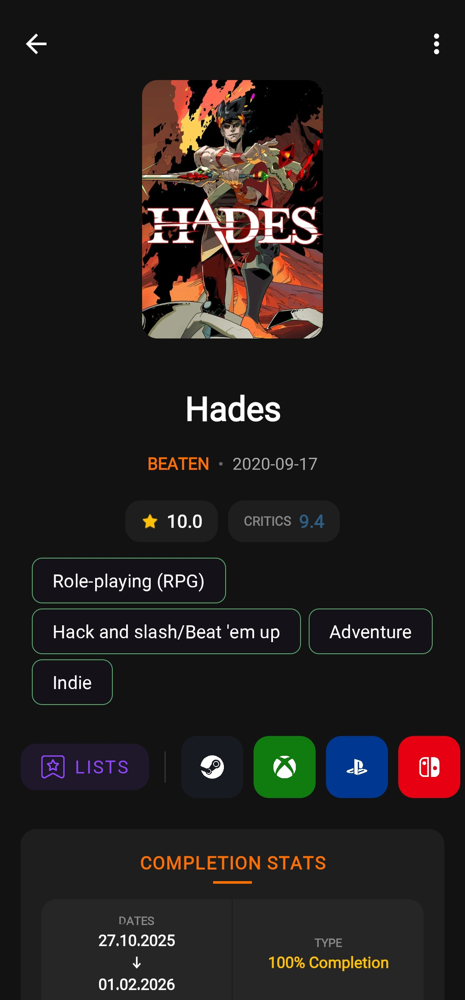
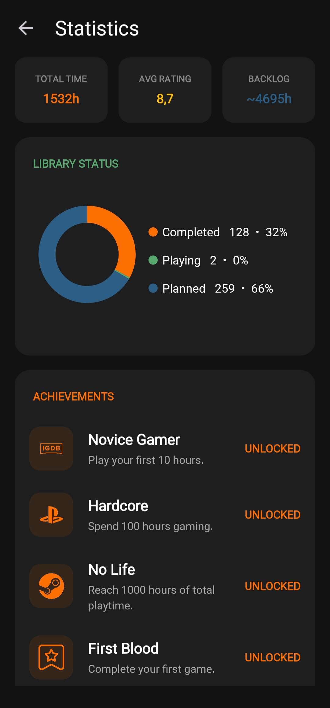

# 🎮 Your Game Library

A clean, modern, and open-source Android application to track your video game collection, manage your backlog, log playtime, and analyze your gaming statistics.


---

## 🌟 Features

* **🎯 Backlog Management:** Keep your gaming collection structured across three primary statuses:
  * **Playing:** Keep track of titles you are currently working through.
  * **Planned:** Manage your upcoming backlog so you never forget what to play next.
  * **Beaten:** Organize all the games you've finished.
* **⭐ Reviews & Playtime Logging:** Log total hours spent, add personal ratings, and write detailed reviews for games you've completed.
* **🔍 IGDB Integration:** Effortlessly search and import game metadata, release dates, and high-resolution cover art powered by the **IGDB API**.
* **📝 Manual Game Entry:** Add custom or indie games manually if they aren't available online.
* **🎨 Custom Lists:** Create personalized game lists, assign custom cover art, and pick unique theme colors for each list.
* **🎡 Backlog Spinner Wheel:** Indecisive about what to play next? Spin the interactive wheel to randomly pick a game from your collection.
* **📊 In-Depth Statistics:** Visualize your gaming habits with comprehensive insights:
  * Total hours played and total games completed.
  * Most played genres in your library.
  * Achievement tracking.

---

## 📷 Screenshots

| Playing Screen | Game Details | Statistics |
| :---: | :---: | :---: |
|  |  |  | *Add screenshot here* | *Add screenshot here* |

---

## 🛠️ Building from Source

To build this app locally using Android Studio or the command line:

1. **Clone the repository:**
   ```bash
   git clone https://github.com/yourusername/yourapp.git
   cd yourapp

2.  Build the APK:

    ./gradlew assembleRelease

    (On Windows, use gradlew.bat assembleRelease)

3.  The generated APK will be located in app/build/outputs/apk/release/.

🔌 API & Credits

  - Game data and cover images are provided by IGDB (Internet Game Database).

📄 License

This project is licensed under the GNU General Public License v3.0 (or your
chosen license) - see the LICENSE file for details.


---

### 💡 Quick Tip:
Replace `yourusername/yourapp` with your actual GitHub username and repository name before committing!
